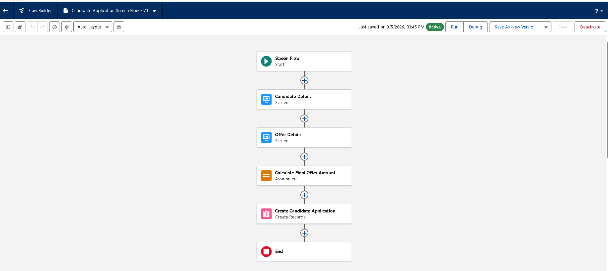
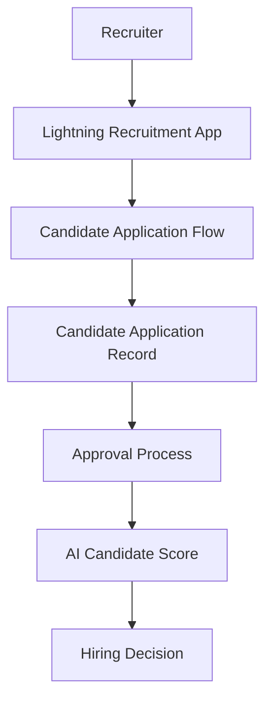

# AI-Powered Job Recruitment & Candidate Management System (AIRCMS)

A Salesforce-based intelligent recruitment platform designed to streamline the end-to-end hiring lifecycle using automation, approval workflows, and AI-assisted candidate evaluation.

---

## Project Overview
The **AI-Powered Job Recruitment & Candidate Management System (AIRCMS)** is a Salesforce Lightning platform solution that centralizes recruitment activities including candidate management, job openings, application tracking, and hiring approvals.

The system integrates Salesforce automation features such as **Flows, Approval Processes, Lightning Applications, Dynamic Forms, and Agentforce AI** to enable recruiters and hiring managers to efficiently manage recruitment operations.

By combining automation and AI-driven insights, the system reduces manual screening effort, improves hiring consistency, and enhances recruitment decision-making.

---
## Quick Navigation

[System Architecture](#system-architecture)  
[Recruitment Workflow](#recruitment-workflow)  
[Implemented Milestones](#implemented-milestones)  

## Key Features

- Centralized recruitment management platform
- Automated candidate application workflow using Salesforce Flows
- AI candidate scoring and hiring insights
- Automated offer approval process
- Lightning App recruitment workspace
- Dynamic Forms for flexible UI customization
- Email alerts for recruitment events
- Role-based access control and governance

---

## System Architecture

The system architecture integrates Salesforce objects, automation workflows, AI insights, and reporting dashboards.

---
## System Workflow

## Technology Stack

| Component | Technology |
|-----------|-----------|
| Platform | Salesforce Lightning Experience |
| Automation | Salesforce Flow Builder |
| AI Integration | Agentforce AI |
| UI Customization | Lightning App Builder |
| Security | Role-Based Access Control |
| Data Management | Salesforce Standard & Custom Objects |

---

## Salesforce Data Model

The AIRCMS platform uses both standard and custom Salesforce objects.

### Standard Objects

- **Contact** – Stores candidate profiles
- **Account** – Represents organizations
- **Opportunity** – Hiring pipeline management

### Custom Objects

- **Job_Opening__c** – Stores job position details
- **Candidate_Application__c** – Tracks candidate applications for specific job openings

---

## Recruitment Workflow

The recruitment process follows a structured automated workflow.

1. Recruiter creates a **Job Opening** record.
2. Candidate information is stored in **Contact**.
3. Recruiter submits a **Candidate Application** using a Screen Flow.
4. The system assigns an **AI Candidate Score**.
5. Recruiter reviews candidate details.
6. Hiring manager approves the offer through the **Approval Process**.
7. Application status is updated automatically.

---

## Implemented Milestones

The AIRCMS system was developed through multiple configuration and automation milestones using Salesforce Admin tools.

| Milestone | Description |
|----------|-------------|
| Milestone 1 | Salesforce Account Setup |
| Milestone 2 | Custom Objects Creation (Job Opening, Candidate Application) |
| Milestone 3 | Tab Creation for Custom Objects |
| Milestone 4 | Fields & Relationships Configuration |
| Milestone 5 | Validation Rules for Data Integrity |
| Milestone 6 | Offer Approval Process |
| Milestone 7 | Email Template Creation |
| Milestone 8 | Email Alerts Configuration |
| Milestone 9 | Declarative Automation using Salesforce Flows |
| Milestone 10 | Agentforce AI Setup |
| Milestone 11 | Lightning Recruitment Application |
| Milestone 12 | Record Page Layout Customization |
| Milestone 13 | Dynamic Forms Implementation |
| Milestone 14 | User Creation and Assignment |
| Milestone 15 | Duplicate & Matching Rules for Candidate Data |
| Milestone 16 | Profile Configuration |
| Milestone 17 | Role Hierarchy Setup |
---

---

## Setup Instructions

To recreate the system:

1. Create required Salesforce custom objects.
2. Configure relationships between Candidate, Job Opening, and Candidate Application.
3. Implement Candidate Application Screen Flow.
4. Configure approval process for offer approvals.
5. Enable Agentforce AI features.
6. Create the Lightning recruitment application.
7. Customize record page layouts.
8. Enable Dynamic Forms for UI flexibility.

---

## Security Model

The platform enforces secure access through role-based permissions.

### Roles

- System Administrator
- Recruiter
- Hiring Manager

### Security Controls

- Profile-based access
- Role hierarchy
- Approval workflows
- Controlled record visibility

---

## Future Enhancements

The system can be further improved with:

- Resume parsing using AI
- Automated interview scheduling
- Candidate ranking algorithms
- Predictive hiring analytics
- Integration with job portals

---

## Team Members

- Mukund Purohit [Team Leader] [@MukundP13](https://github.com/mukundp13)
- Nitin Jain
- Piyush Purwar
- Riya Sahu

Team #261

---

## Institution

Lakshmi Narain College of Technology  
Bhopal, Madhya Pradesh

---

## Program

SkillWallet – Salesforce Administrator with AI Agentforce

---

## License

This project is developed as part of an academic training program under SkillWallet.
